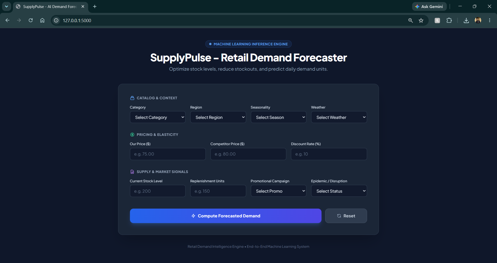
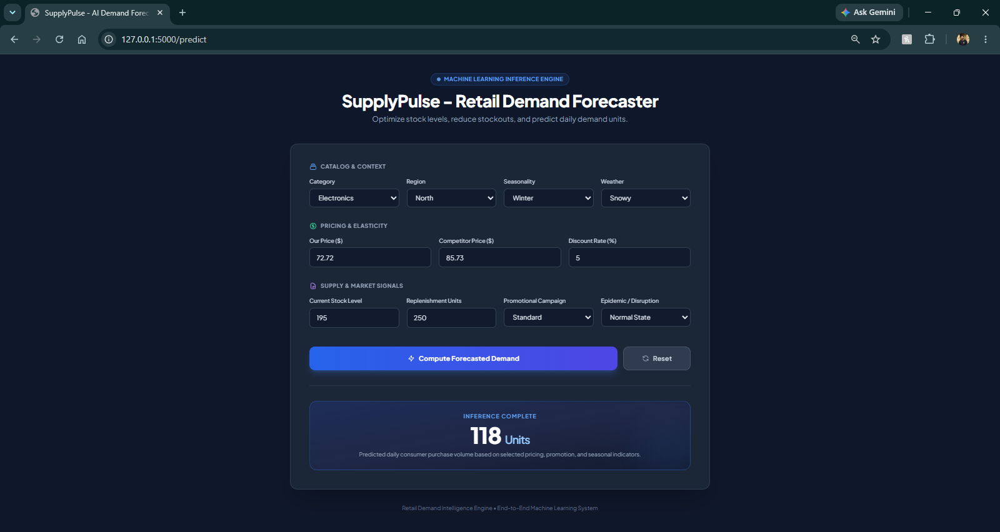

# Retail Product Demand Forecasting System
### End-to-End Machine Learning & Web Deployment Project Report

---

## 1. Project Overview & Business Impact

In the retail and supply chain industry, balancing inventory levels is one of the most critical operational challenges. 
- **Stockouts** lead to missed sales opportunities, backorders, and unhappy customers.
- **Overstocking** ties up working capital, increases warehousing costs, and risks product obsolescence or spoilage.

This project delivers a machine learning solution that accurately forecasts daily consumer product demand across diverse retail categories. Rather than relying on simple moving averages, the system captures non-linear interactions among product pricing, promotional campaigns, competitor pricing shifts, seasonal variations, and warehouse replenishment volumes.

---

## 2. Dataset Overview

The project was trained and validated on historical retail transaction records containing multi-dimensional operational attributes:

- **Identifiers & Context:** Transaction Date, Store ID, Product ID, Geographic Region (North, South, East, West).
- **Product Hierarchy:** Five core categories — Electronics, Clothing, Furniture, Groceries, and Toys.
- **Pricing & Discounts:** Selling Price ($), Competitor Benchmark Pricing ($), and Active Discount Rate (%).
- **Supply & Inventory Metrics:** Current Warehouse Stock Level and Replenishment Units Ordered from suppliers.
- **External & Environmental Factors:** Local Weather (Sunny, Rainy, Snowy, Cloudy), Seasonality (Winter, Spring, Summer, Fall), and Crisis/Epidemic Disruption indicators.
- **Marketing:** Binary promotional campaign flags.
- **Target Variable:** Total units demanded by consumers (`Demand`).

---

## 3. Exploratory Data Analysis (EDA) & Key Findings

Before building predictive models, a thorough exploratory analysis was performed to uncover behavioral patterns in the data:

1. **Distribution of Demand:** The target variable (`Demand`) was evaluated to understand typical buying volumes and identify overall sales skewness.
2. **Impact of Marketing Promotions:** Comparative distribution plots demonstrated that items backed by active marketing campaigns experienced significant, quantifiable demand lifts over non-promotional days.
3. **Category Variations:** High-turnover goods (such as Groceries) demonstrated distinct baseline ordering patterns compared to higher-ticket durable goods (like Furniture and Electronics).
4. **Correlation Analysis:** Correlation heatmaps confirmed strong dependencies between replenishment orders, pricing differentials, and final consumer demand, while revealing that simultaneous transaction metrics (like raw historical units sold) would introduce severe target leakage if left unchecked.

---

## 4. Data Preprocessing & Feature Engineering

To prepare raw data for robust machine learning, extensive data cleaning and transformations were executed:

- **Outlier Capping (IQR Winsorization):** Real-world supply data contains extreme spikes. Variables like `Units Ordered`, `Inventory Level`, and `Price` were analyzed using the Interquartile Range (IQR) method. Values exceeding $Q_3 + 1.5 \times \text{IQR}$ or falling below $Q_1 - 1.5 \times \text{IQR}$ were capped rather than deleted, preserving full dataset size without distorting model weights.
- **Variance Stabilization:**
  - Applied a log transformation ($\ln(1 + x)$) to skewed supplier order volumes to compress large restock orders into balanced distributions.
  - Applied a square root transformation ($\sqrt{x}$) to raw inventory numbers to stabilize variance.
- **Price Elasticity Metrics:** Engineered domain-specific features:
  - **Price Difference:** $\text{Competitor Pricing} - \text{Our Price}$ (measuring competitive advantage).
  - **Discount Amount:** Net cash savings passed to the consumer.
  - **Price Ratio:** Relative pricing competitiveness compared to the market.
- **Calendar & Temporal Extraction:** Extracted month, day of the week, quarter, and weekend indicators from dates to detect weekly and cyclic shopping habits.
- **Categorical Transformations:**
  - Ordinal encoding for calendar seasons (`Seasonality`).
  - One-hot encoding for nominal attributes (`Category`, `Region`, `Weather Condition`), systematically dropping one dummy category to avoid multicollinearity.
- **Strict Leakage Prevention:** Discarded non-generalizable keys (`Store ID`, `Product ID`, `Date`) and concurrent outcome variables (`Units Sold`), isolating 25 clean predictive features.

---

## 5. Statistical Hypothesis Testing

Prior to modeling, statistical tests were conducted to verify that observed patterns represented genuine population differences:

- **Two-Sample Independent $t$-Test:** Evaluated whether running a promotional campaign produces a statistically significant change in demand. The test returned a $p$-value well below 0.05 ($p < 0.001$), confirming promotions are a primary demand driver.
- **One-Way ANOVA:** Tested whether consumer purchasing levels differ significantly across the four seasons (Winter, Spring, Summer, Fall). The resulting $F$-statistic confirmed strong seasonal variations.
- **Chi-Square Test of Independence:** Analyzed categorical interactions between environmental weather patterns and macroeconomic disruption indicators.

---

## 6. Model Training, Benchmarking & Selection

The processed data was split into an **80% training set** and a **20% held-out test partition** (15,200 records). Five regression architectures were trained and benchmarked across four evaluation metrics (MAE, MSE, RMSE, and $R^2$):

1. **Linear Regression (OLS Baseline):** Provided a baseline understanding ($R^2 \approx 0.54$), proving that consumer demand behavior is too non-linear for basic straight-line modeling.
2. **Support Vector Regressor (SVR - RBF Kernel):** Captured localized non-linear boundaries but struggled with computational overhead on large retail data ($R^2 \approx 0.52$).
3. **Multi-Layer Perceptron (MLP Regressor):** A feedforward neural network that improved upon linear representations ($R^2 \approx 0.61$).
4. **Gradient Boosting Regressor:** A sequential ensemble model that produced strong predictive power ($R^2 \approx 0.66$).
5. **Random Forest Regressor (Champion Model):** A bagging ensemble that excelled at learning interactions across price differences, replenishment volumes, and category types. It achieved the best performance:
   - **$R^2$ Score:** $\approx 0.70$
   - **Root Mean Squared Error (RMSE):** Lowest among all models ($\approx 25.6$ units)

### Hyperparameter Tuning & Pipeline Assembly
An end-to-end `scikit-learn` `Pipeline` was constructed, chaining `StandardScaler` with the `RandomForestRegressor`. Using `GridSearchCV`, optimal tree depth, estimator counts, and sample split parameters were identified. The finalized pipeline was serialized into `demand_prediction_pipeline.pkl`.

---

## 7. Web Application & Deployment Architecture

To make the machine learning model usable by store managers and supply chain planners, a web application was developed using **Flask** and styled with **Tailwind CSS**.

### Key UI/UX Features:
- **Clean Default State:** On first load, all dropdowns display clean placeholders (`-- Select Category --`) and numeric fields are empty, with no pre-computed output displayed.
- **State-Retaining Form:** After clicking "Compute Forecasted Demand," the interface displays the predicted demand units in a highlighted banner while keeping all user-selected dropdown options and input values filled in.
- **Dedicated Reset Action:** A one-click Reset button refreshes the entire form back to a blank state.
- **REST API Endpoint:** Includes a `/api/predict` route that accepts structured JSON payloads, allowing ERP and inventory systems to fetch predictions programmatically.

---

## 8. Conclusion & Business Takeaways

1. **Non-Linear Dynamics in Retail:** Linear models alone are insufficient for retail demand; ensemble tree architectures like Random Forest are far better suited for capturing promotional spikes and price shifts.
2. **Primary Operational Drivers:** Supplier order velocity (`Units Ordered`), promotional flags, and price margins against competitors proved to be the most influential predictors of customer purchases.
3. **Practical Deployment:** Encapsulating the model inside a leak-free pipeline and deploying it via a modern web interface bridges the gap between raw data science research and actionable supply chain tooling.

---

## 9. Output Screenshots

*Note: Save your two screenshot image files in your project directory (for example, inside an `images/` folder) matching the file names below:*

### Screenshot 1: Initial Default Landing State
Displays the application upon launch, showing clean nil/blank dropdown options and empty input placeholders with no output calculated yet.

---

### Screenshot 2: Prediction Output & State Retention
Displays the live inference result after submitting product parameters, showing the retained input values and the generated forecasted demand units banner.

